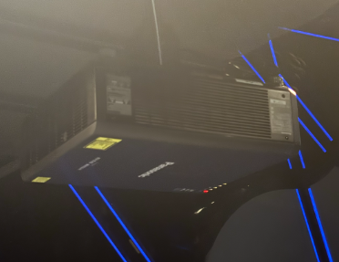
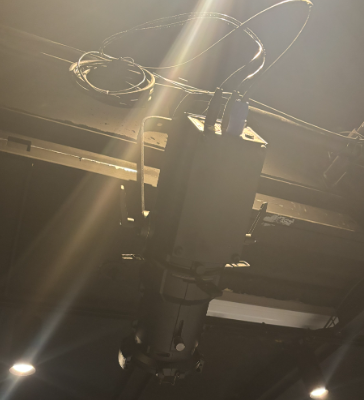
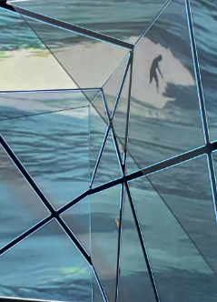

<h1 align="center">GÉNÉRATION MONTRÉAL</h1>

 

 
**Lieu :** Musé Pointe-à-Callière

**Type d'exposition :** Permanante et intérieure

 Date de réalisation  :En mai 2019

**Date de visite :** 21 février 2025

## Description de l'oeuvre

L'œuvre est une représentation de la vie de la ville de Montréal. Pendant la projection de 17 minutes, on peut voir les différentes étapes de la création de la ville, depuis ses débuts jusqu’à aujourd’hui. Les images sont projetées sur de grands écrans aux formes irrégulières, ce qui rend le tout visuellement très impressionnant en raison des couleurs utilisé.

La présentation est animée par six personnages projetés, qui prennent la parole chacun à leur tour pour raconter les moments importants de l’évolution de Montréal. Chacun apporte son point de vue, ce qui permet de mieux comprendre comment la ville s’est construite à travers le temps.

## Type d'installation

L’œuvre Générations Montréal est une installation immersive conçue pour plonger les spectateurs au cœur de l’expérience, en les enveloppant visuellement et auditivement.

## Mise en espace 

L'œuvre est présentée dans une grande salle de l'établissement où les spectateurs sont assis sur des estrades surélevées, permettant d'observer les projections de haut. La pièce est remplie de pierres anciennes datant des premières années de la création de la ville.

## Composantes techniques

L'œuvre possède de nombreuses composantes techniques qui contribuent à en faire une véritable œuvre. Les voici:

Projecteur |  Éclairage |  Écran |
:-------------------------:|:-------------------------:|:-------------------------:|
||

 
PROJECTEUR: 22 projecteurs vidéo sont placé a différent endroit dans la salle. Les 22 projecteurs sont parfaitement synchrones. La surface de projection est de  4 200 pieds carrés, soit 390 mètres carrés.
 

  
 ÉCLAIRAGE: Des gros projecteurs d'éclairage sont également situé dans les hauteurs de l'édifice soutenu par des strucutres de métals qui rend une certaine ambiance dans la salle. 
 

  
Écran : Des écrans-miroirs prolongent les projections sous forme d’images poétiques, tandis que des tulles permettent de créer des effets de transparence. Chaque écran est équipé d’une bande lumineuse DEL munie d’une lentille diffusante.
 

SOURCE: https://www.newswire.ca/fr/news-releases/le-lieu-de-fondation-de-montreal-plus-vivant-que-jamais--848569888.html

## Élément nécessaire

Nombreux élément sont nécessaire pour la présentation de l'oeuvre au pubic 

Projecteur |  Éclairage |  Écran |
:-------------------------:|:-------------------------:|:-------------------------:|
||

