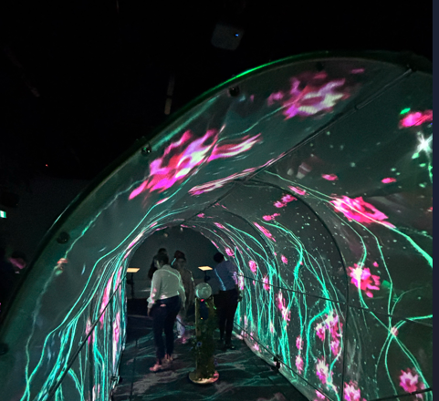
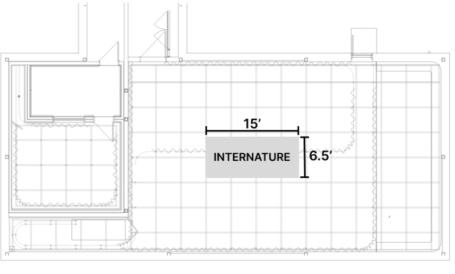
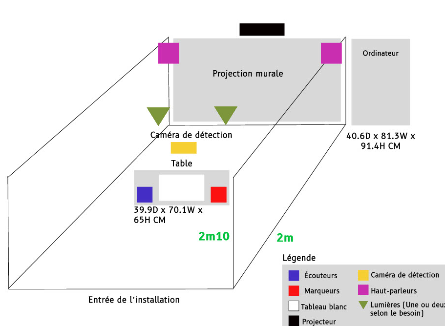
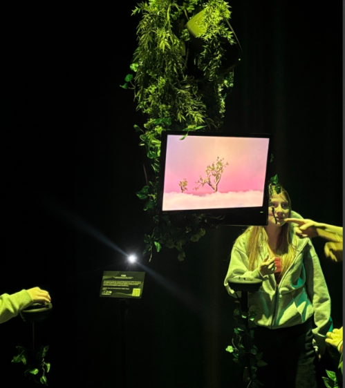
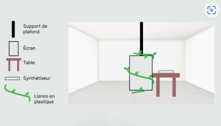

<h1 align="center">LES AUTRE PROJETS</h1>
 

 #  <h1 align="center"> #1 INTERNATURE</h1>

 ## Équipe
Sitmonternna Yi:   Mapping vidéo et conception sonore

Delphine Grenier:  conception visuel et programeuse

Isaac Fafard:      Programmeur

Kenza El Harrif:   Directrice artistique

Khaly Tia Sing:     Chargé de projet   

## Ressenti

Lorsque nous entrons dans la sphère, on a l'impression de plonger dans un nouvel univers fantastique, où chaque détail semble irréel. Des projections animées et fascinantes illuminent l'espace, rendant l'expérience encore plus immersive et magique, et nous transportent dans un autre monde, où le temps semble s'arrêter.

## Cours incontournables
Programmation interactive / Traitement audiovisuel / Audio

## Technique utilisé

 Ce qui m’a le plus intrigué, ce sont les techniques de projection sur des surfaces arrondies que les étudiants ont dû ajuster minutieusement à l’aide de logiciels de mapping. Je pensais, à tort, que toute la projection se faisait uniquement grâce au projecteur, sans se soucier de la déformation des images.

   
  
source:https://tprangers.github.io/internature/#/

 

 #  <h1 align="center"> #2 PRISMATICA </h1>

 ## Équipe
Vincent Delisle:  Développeur et concepteur sonore

Ikrame Rata:      Chef de projet

Jérémy Duverseau:  Directeur Artistique

## Ressenti

 Lorsque nous entrons dans la salle, nous n’avons pas encore d'idée précise du concept. Une forte curiosité m'envahit alors, et lorsque nous commençons à explorer le projet, cette curiosité s’intensifie. Nous sommes de plus en plus intrigués par tout ce que nous pouvons créer avec les nombreux dessins que nous devons réaliser

## Cours incontournables
Programmation interactive / Traitement audiovisuel / Audio

## Technique utilisé

 J'ai trouvé la technique de capture vidéo de la planche à dessin très intéressante, car grâce à la caméra vidéo, elle permet de capturer en temps réel les dessins, assurant ainsi la synchronisation des éléments sonores et visuels.

   LIEN YOUTUBE: https://studio.youtube.com/video/SMC4XM5rJOo/edit
  

source: https://pootpookies.github.io/Prismatica/#/

 

 #  <h1 align="center"> #3 FUGA</h1>

 ## Équipe
Yavuz-Selim Gucluer:  Programmeur

Matis Labelle:        Chargé de projet

Daniel Dezemma:   Directeur Visuel

Tristan Kkadka:   Directeur sonore

Abdel Ali Djeral:   Programmeur  

## Ressenti

Lorsque nous approchons de l'installation, nous pouvons immédiatement nous projeter dans un univers forestier avec des décors feuillus. Ensuite, lorsque tu interagis avec le dispositif, tu dois laisser libre cours à ton côté artistique pour créer un arbre à ton image avec différents boutons 

## Cours incontournables
Programmation interactive / Design graphique/ Audio

   
  
source: https://escapism-fuga.github.io/Fuga/#/

 #  <h1 align="center"> #3 ARCADIA </h1>

 ## Équipe
Dominic Yale:        Conception sonore

William Beauvais:    Conception visuel

Anton Nikulin:       Programmation

## Ressenti

Lorsque nous nous trouvons devant l'installation, on peut facilement entrer dans un mode de jeu d'arcade, comme dans les fêtes foraines où l'on joue avec des jetons. Dès que l'on commence à jouer, l'esprit compétitif des jeux d'arcade entre en nous

## Cours incontournables
Programmation interactive / Design Graphique / Audio

## Technique utilisé

Ce qui m'intéresse le plus dans ce dispositif, ce sont les différents boutons avec lesquels les utilisateurs peuvent interagir pour faire avancer la quête des personnages du jeu.

   LIEN YOUTUBE: https://studio.youtube.com/video/SMC4XM5rJOo/edit
  

source: https://pootpookies.github.io/Prismatica/#/

