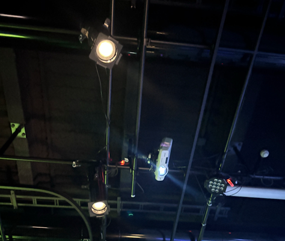
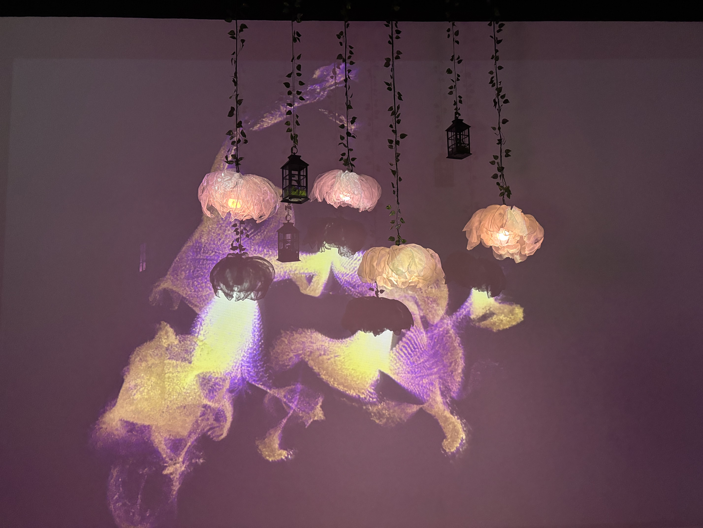

<h1 align="center">LUMINATURA</h1>
 

 
**Lieu :** College Montmorency/ grand studio

**Type d'exposition :** Temporaire et intérieure

Année de réalisation  : 2025

**Date de visite :**  3 mars 2025

<h1 align="center">MEMBRE DE L'ÉQUIPE D'ARTISTES</h1>

 
Camilia Bouatmani:    Directrice Artistique

Prethiah Pajaratnam:  Programmeuse et Administratrice du projet

Audrey Dandurand:     Directrice audio visuel et Gestionnaire de projet

Justine Rousseau:     Programeuse coordonnatrice des média

Ihab Mouhajer:        Développeur interactif    

<h1 align="center">DESCRIPTION DE L'OEUVRE</h1>

Luminatura est une expérience immersive mêlant la nature et la technologie, où des fleurs lumineuses éclairent votre chemin, tandis que des vignes et des lanternes ornent l’espace, créant ainsi une ambiance chaleureuse. En touchant une plaque métallique, un capteur capacitif détecte la conductivité de la peau des utilisateurs, activant une réaction lumineuse et sonore. Cela souligne notre capacité à embellir et éclairer notre environnement grâce à la conductivité de notre peau.

SOURCE: https://miaou-mafia.github.io/projet-luminatura/#/20_intention/10_synopsis/

<h1 align="center">TYPE D'INSTALLATION</h1>

Installation interactive

<h1 align="center">MISE EN ESPACE</h1>

La mise en espace de l'installation interactive est situé dans un grand studio dans le College Montmorency qui fait 15.26m de longueur et 9.06m de large avec un mur de type cyclorama

Source pour les mesures du studio: https://tim-montmorency.com/

<h1 align="center">COMPOSANTES ET TECHNIQUE</h1>

## Voici les nombreux éléments utilisés par les artistes, qui ont dû les acheter par leurs propres moyens pour la réalisation de leurs projets.

10-15 vignes artificielles en plastique

6 ampoules LED

3 plaques en acier

2 lanternes

6 extensions pour lumière (câbles)

1 tissu (3m) de couleur jaune

1 tissu (3m) de couleur rose

1 tissu (3m) de couleur blanche

3 résistances

1 câble en acier

6 câbles métalliques en acier inoxydable

Ruban adhésif métallique

SOURCE: https://miaou-mafia.github.io/projet-luminatura/#/30_production/40_devis/

## Voici les nombreux autres éléments utilisés par les artistes, qui ont été fournis par le college Montmorency 

Câbles (HDMI, Ethernet, audio)

1 PC

1 ordinateur portable

3 haut-parleurs GENELEC 8030C

3 support (support des haut-parleurs)

6 supports imprimés en 3D

1 câble DMX

1 carte de son

1 microcontrôleur Atom M5

5 câbles Ethernet

SOURCE: https://miaou-mafia.github.io/projet-luminatura/#/30_production/40_devis/

## Pour mettre en œuvre leur projet, les étudiants ont dû utiliser de nombreux logiciels afin que leur projet puisse bien se mettre en marche.

REAPER: Montage sonore

PLUGDATA: Effet sonores

Arduino: Capteur de type « sensing capacitif » et connexion des composants

QLC+:	Création des scènes lumineuses

Puredata:	Envoi de données des différents logiciels

SOURCE: https://miaou-mafia.github.io/projet-luminatura/#/30_production/40_devis/

<h1 align="center">VOICI LES PRINCIPALES COMPOSANTES TECHNIQUES QUE LES UTILISATEURS PEUVENT APERCEVOIR.</h1>

## 3 PLAQUES MÉTALIQUES

Trois plaques métalliques sont situées devant le mur blanc. Les plaques métalliques sont utilisées pour provoquer un changement de couleur de la projection et également pour générer un effet sonore. C'est lorsque les utilisateurs posent leurs mains sur la plaque que le capteur de capacitance détecte la peau, ce qui provoque une réponse en fonction de la capacitance.

## HAUT-PARLEUR

Trois haut-parleurs sont placés juste en dessous des plaques métalliques. Lorsque les individus touchent les plaques, les effets sonores sortiront de ces haut-parleurs.

## ÉCLAIRAGE ET PROJECTEUR

De nombreux éléments d'éclairage sont suspendus au plafond du studio sur une structure métallique.

Un projecteur est orienté vers le grand mur blanc où des projections de couleur peuvent être réalisées.

Un autre projecteur projette une image sur les plaques métalliques.

Des spots lumineux contribuent également à créer une ambiance.

#  <h1 align="center">CE QUI MA PLU.</h1>

Ce que j'ai le plus aimé, c'est l'ambiance que nous avons traversée pendant cette expérience. Nous avions l'impression d'être dans une forêt magique avec un petit ruisseau. 
Les bruits sonores nous placent dans un mode de relaxation, et les couleurs sont très bien choisies ; elles nous rappellent la nature.

 

 
 

 
 

