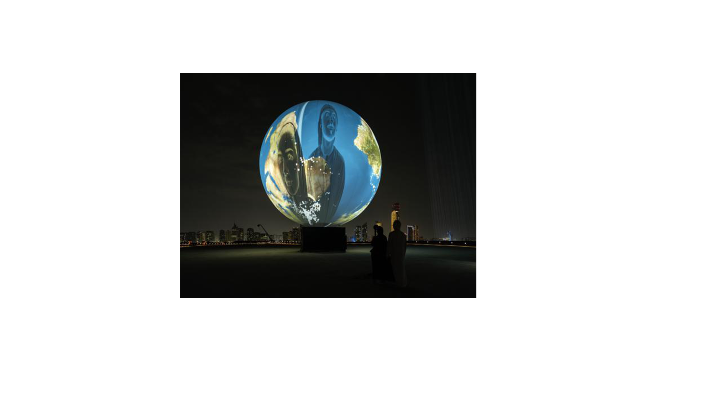

# CONFÉRENCE DE JADE SÉGUÉLA

Madden Sharp / 9 avril 2024

## lntroduction
Le mardi 25 mars 2025, Jade Séguéla, régistraire pour le studio Antimodular de Rafael Lozano-Hemmer, a donné une conférence dans la salle Claude Legault du Collège Montmorency. Madame Séguéla est venue nous parler de son emploi et de deux œuvres majeures réalisées par le studio.

## Présentation
Premièrement, l'intervenante est venue nous parler de son métier au sein du studio, où elle occupe le poste de régistraire. Ce rôle implique une connaissance approfondie des œuvres, car elle est responsable de leur installation et de leur désinstallation. Elle doit également veiller à trouver les caissons en bois nécessaires pour le transport des œuvres, que ce soit pour des musées ou des collectionneurs, et ce, dans différents pays à travers le monde, par bateau ou en camion. Elle travaille pour l'artiste mexicain-canadien Rafael Lozano-Hemmer, un artiste multimédia. Il s'est installé à Montréal et a ouvert son studio de création.

## L'importance du public
Pour Rafael Lozano-Hemmer, la participation du public est primordiale lorsqu'une œuvre est exposée, car, selon lui, sans le public, l'œuvre ne serait pas véritablement une œuvre.

## Voici deux œuvres présentées lors de la conférence
La première œuvre que Jade Séguéla nous a présentée est *Sphere Packing*, une sphère de 10 pieds de diamètre composée de 1128 haut-parleurs. Chaque haut-parleur diffuse une composition différente de Johann Sebastian Bach.

La deuxième œuvre est *Shadow Tuner*. Elle est installée sur une île déserte en Arabie saoudite. L'œuvre prend la forme d'une immense sphère de 25 mètres de diamètre, ressemblant à un ballon de montgolfière. Quatre projecteurs font le tour de la sphère, sur laquelle est projetée l'image de la planète Terre. Des capteurs sont également placés sur sa circonférence. Le but de l'œuvre est de permettre aux visiteurs d'écouter les radios du monde entier en se déplaçant autour de la sphère.

## Conclusion
Bref, la conférence fut très intéressante. La découverte de ces œuvres m'a beaucoup inspiré. Ce que j'ai appris lors de cette conférence, c'est que leur métier n'est vraiment pas facile, car l'envoi d'œuvres semble très compliqué, surtout lorsqu'elles sont envoyées dans différents pays. Il faut toujours trouver des solutions, car tout ne fonctionne pas toujours du premier coup.

  

  photo de l'oeuvre en exposition au Abu Dhabi, United Arab Emirates, 2023. Shadow tuner photo Rafael Lozano-Hemmer 

source des images
shadown turner: https://lozano-hemmer.com/showimage_emb.php?proj=shadow_tuner&img=abu_dhabi_2023&idproj=410&type=artwork&id=7

