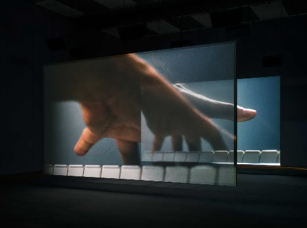
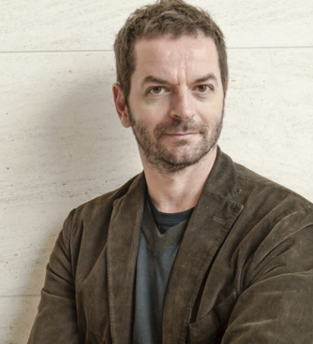
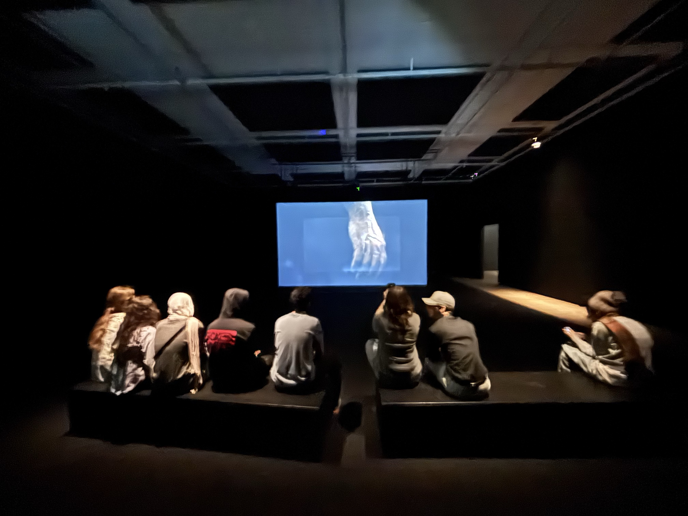
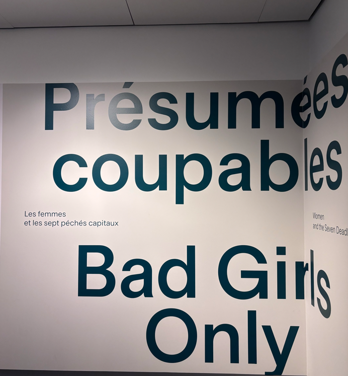
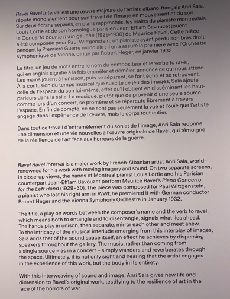
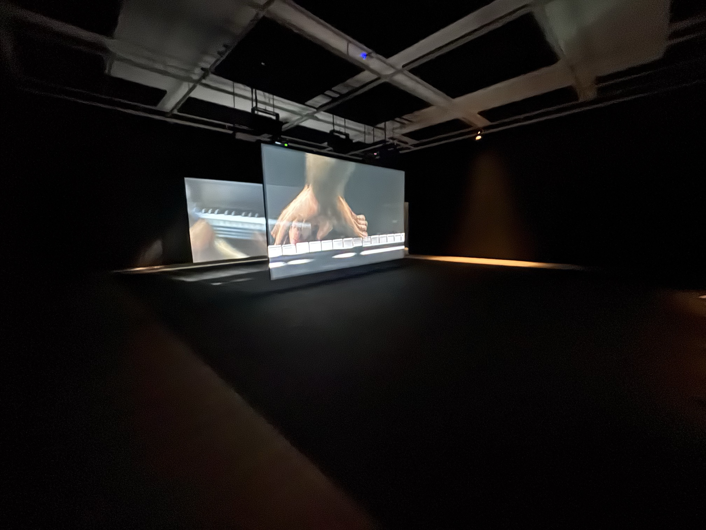
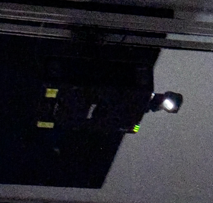
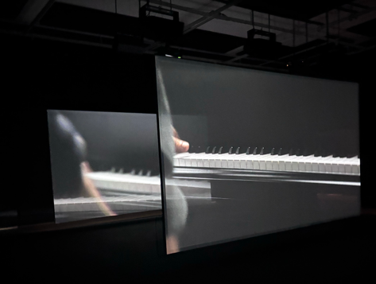

 # RAVEL RAVEL INTERVAL</h1>

Anri Sala : Ravel Ravel Interval (https://www.mbam.qc.ca/fr/expositions/)

 
**Lieu :** Musée des beaux arts de Montréal

**Type d'exposition :** Temporaire et intérieure

 Date de réalisation  : 2017

**Date de visite :** 4 avril 2024

## Artiste

Anri Sala est un artiste qui a étudier à l’Académie des Beaux-Arts d’Albanie de 1992 à 1996. Il a également étudié la vidéo à l’École Nationale des Arts Décoratifs à Paris. Il fait nombreuse oeuvre vidéo comme celle de RAVEL RAVEL INTERVAL. 

Anri Sala | 
:-------------------------:|

## Description de l'oeuvre

RAVEL RAVEL INTERVAL est une installation vidéo. L’œuvre met en scène deux pianistes qui joue séparément le Concerto pour la main gauche de Maurice Ravel, une pièce composée pour un seul bras. Les deux enregistrements sont diffusés simultanément sur deux écrans, dans une mise en scène où les décalages rythmiques subtils créent une nouvelle écoute.

vue oeuvre | 
:-------------------------:|

mur d'entrée |  texte descriptif | 
:-------------------------:|:-------------------------:|
|

## Type d'installation

l'installation d'Anri Sala est une ouevre de type immersif, car elle met les spectateurs dans un univers audio visuel 

## Mise en espace

L'oeuvre est disposé dans une grande salle insonirisé du musé des arts de Montréeal. Nous pouvons êtres plusieurs dans la même salle pour pouvoir apprécier l'oeuvre. Nous sommes projecté dans une salle sombre pour pour d'avantage apercevoir les projections sur les deux écrans du l'oeuvre.

vue d'ensemble| 
:-------------------------:|

## Composantes

L'œuvre se compose de nombreux éléments nécessaires à son fonctionnement. Elle inclut des projecteurs vidéo HD en couleur, qui projette des images sur deux écrans transparents. Le dispositif comprend également 14 haut-parleurs diffusant les différentes mélodies jouées au piano.

projecteur | écran | 
:-------------------------:|:-------------------------:|
|

